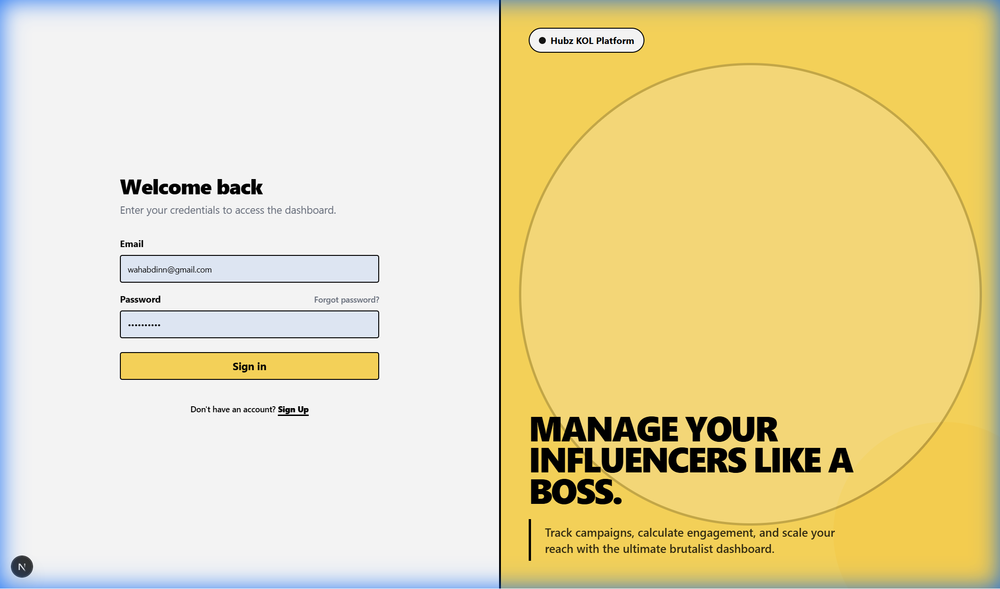
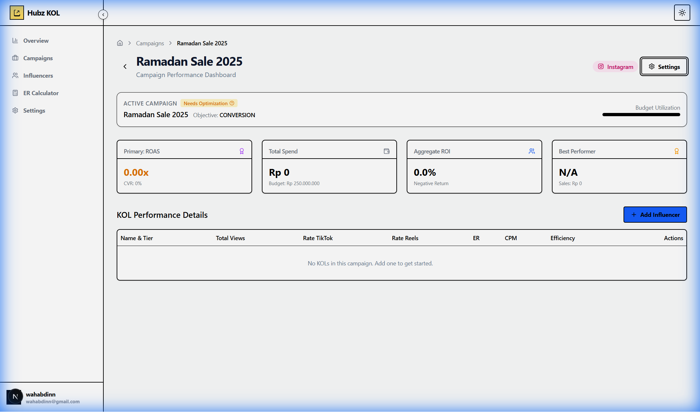
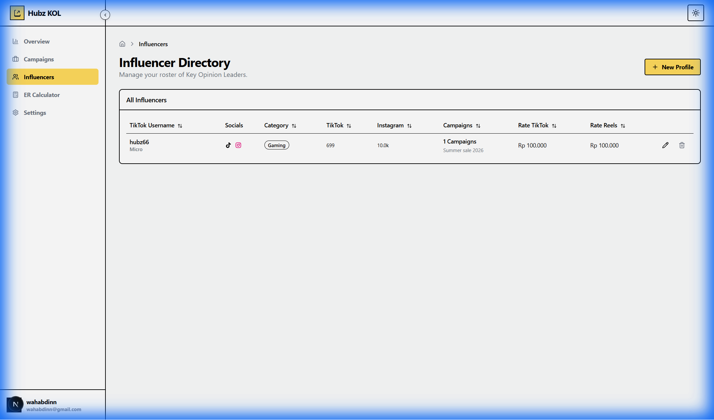

# Hubz Porto KOL

A **Neo-Brutalist** Influencer Management & Analytics Dashboard built for the modern marketing era. It combines high-impact aesthetics with powerful campaign tracking logic.


## 🚀 Key Features

### 1. Neo-Brutalist Design System
A custom "Pop" design system featuring:
- **Vibrant Palette**: Primary Yellow (`#FFDA5C`), Stark Black, and Soft Cream.
- **Bold UI**: Thick 2px borders, hard shadows, and high-contrast typography.
- **Split-View Auth**: Custom Login/Register pages that break the mold of standard SaaS templates.



### 2. Campaign Intelligence & AI
Track from Awareness to Conversion:
- **AI Smart Match**: Rank influencers based on campaign fit.
- **Performance Metrics**: Monitor ROAS, CVR, CPM, and Virality Rate.
- **Efficiency Score**: Custom metric for spend efficiency (Views per Rp 1,000).



### 3. Workflow & Reports
- **Kanban Board**: Drag-and-drop workflow status management (`@dnd-kit`).
- **PDF Reporting**: Client-ready campaign summaries generated client-side (`@react-pdf/renderer`).
- **Profile Popups**: Instant access to creator stats.

### 4. Robust Influencer Management
- **Real-World Schema**: Maps directly to Supabase with support for separate Platform IDs and Rate Cards.
- **Tiering System**: Automated categorization (Nano - Mega).
- **Type Safety**: Fully typed database interactions using Supabase generated types + Zod validation.



### 5. Enterprise Controls
- **RBAC (Role-Based Access Control)**: Granular permissions for Super Admins vs Members via Supabase RLS.
- **Secure Data**: Protected mutations and read policies.

---

## 🛠 Tech Stack

- **Framework**: [Next.js 15](https://nextjs.org/) (App Router)
- **Styling**: [Tailwind CSS v4](https://tailwindcss.com/) + [Shadcn UI](https://ui.shadcn.com/)
- **Database**: [Supabase](https://supabase.com/) (PostgreSQL & Auth)
- **Data Fetching**: TanStack Query + Supabase SSR
- **Validation**: Zod + React Hook Form
- **Reporting**: React-PDF
- **Visuals**: Lucide React Icons & Recharts

## ⚡ Getting Started

1. **Install Dependencies**:
   ```bash
   npm install
   ```

2. **Configure Environment**:
   Create a `.env` file in the root directory:
   ```env
   NEXT_PUBLIC_SUPABASE_URL=your_supabase_url
   NEXT_PUBLIC_SUPABASE_ANON_KEY=your_supabase_anon_key
   ```

3. **Run Development Server**:
   ```bash
   npm run dev
   ```
   Open [http://localhost:3000](http://localhost:3000) to view the dashboard.

## 📦 Optimization

- **Type Safe**: End-to-End TypeScript coverage.
- **Fast Loading**: Server Components + Image Optimization.

---
*Built for Hubz Porto.*
