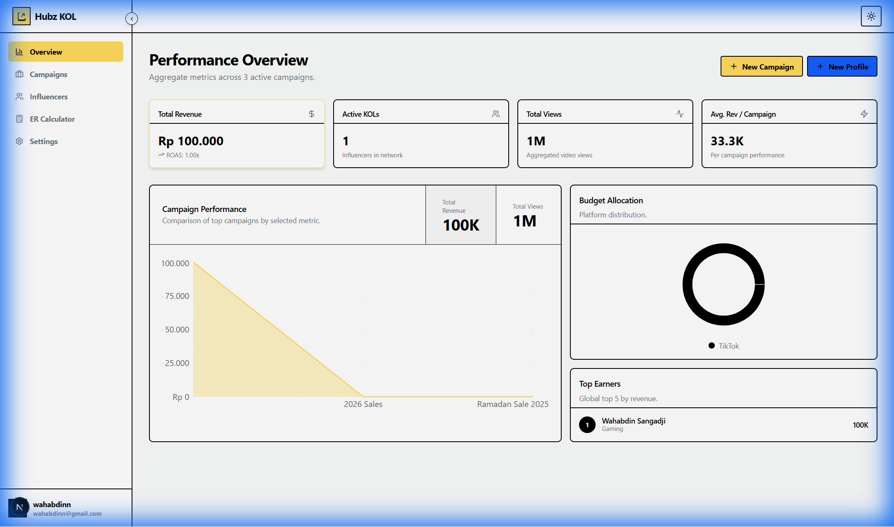

# Hubz Porto KOL

A **Neo-Brutalist** Influencer Management & Analytics Dashboard built for the modern marketing era. It combines high-impact aesthetics with powerful campaign tracking logic.



## 🚀 Key Features

### 1. Finance Command Center

Comprehensive financial oversight built directly into your workflow:

- **Revenue & Spend Tracking**: Real-time P&L analysis per campaign and platform.
- **Invoicing System**: Create, track, and manage invoices with status workflows (Draft -> Paid).
- **Profitability Metrics**: Automated ROI calculations and budget utilization tracking.
- **PDF Generation**: Instant invoice PDF generation for billing.

### 2. Advanced KOL Management

A robust CRM for your influencer network:

- **Detailed Profiles**: Track engagement rates, follower counts, and contact info.
- **Content Library**: Embed and play TikTok/Instagram content directly within the profile using the `ContentEmbed` system.
- **Tiering System**: Automated categorization (Nano, Micro, Macro, Mega) based on follower count.
- **Performance History**: View past campaign performance and payment history for every creator.

### 3. Campaign Operations

End-to-end campaign lifecycle management:

- **Kanban Task Board**: Drag-and-drop workflow status management.
- **Gantt Chart Timeline**: Visual project planning and scheduling.
- **Deliverables Tracking**: Track video/post submissions and approval status.
- **AI Smart Match**: Rank influencers based on campaign fit.

### 4. RetroUI Design System

A custom "Pop" design system featuring:

- **Vibrant Aesthetic**: Primary Yellow (`#FFDA5C`), Stark Black, and Soft Cream.
- **Tactile Interactions**: Buttons and cards feature dynamic "press" states and hard shadows.
- **Consistent Styling**: Unified design language across Dashboard, Forms, and Lists.

### 5. Productivity Tools

- **Keyboard Shortcuts**: Navigate efficiently with `Ctrl+K` command palette and hotkeys.
- **Onboarding Tour**: Interactive guided tour for new users.
- **Date Range Filtering**: Global date filtering for all analytics views.
- **Quick Actions**: "New Invoice", "Add KOL", and "New Campaign" accessible from anywhere.

---

## 🛠 Tech Stack

- **Framework**: [Next.js 15](https://nextjs.org/) (App Router)
- **Styling**: [Tailwind CSS v4](https://tailwindcss.com/) + [Shadcn UI](https://ui.shadcn.com/) + RetroUI
- **Database**: [Supabase](https://supabase.com/) (PostgreSQL & Auth)
- **Data Fetching**: TanStack Query + Supabase SSR
- **Visualization**: Recharts, React Day Picker
- **Validation**: Zod + React Hook Form
- **Utilities**: Framer Motion, Sonner, React-PDF

## ⚡ Getting Started

1. **Install Dependencies**:

   ```bash
   npm install
   ```

2. **Configure Environment**:
   Create a `.env` file in the root directory:

   ```env
   NEXT_PUBLIC_SUPABASE_URL=your_supabase_url
   NEXT_PUBLIC_SUPABASE_ANON_KEY=your_supabase_anon_key
   ```

3. **Run Development Server**:
   ```bash
   npm run dev
   ```
   Open [http://localhost:3000](http://localhost:3000) to view the dashboard.

## 📦 Optimization

- **Type Safe**: End-to-End TypeScript coverage.
- **Fast Loading**: Server Components + Image Optimization.
- **Responsive**: Fully optimized for Desktop, Tablet, and Mobile devices.

---

_Built for Hubz Porto._
